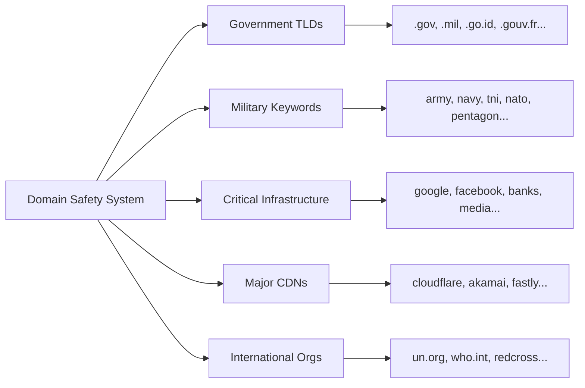

<div align="center">


# 🔥 DDoSSCAN

### *Advanced Network Availability & Stress Testing Framework*

[](https://github.com/ruyynn/DDoSSCAN)
[](https://python.org)
[](LICENSE.txt)
[](https://termux.com)

[](https://github.com/ruyynn)
[](https://web.facebook.com/profile.php?id=61587795784907)
[](mailto:ruyynn25@gmail.com)
[](https://saweria.co/Ruyynn)

</div>

---

## 🚨 **IMPORTANT LEGAL NOTICE**

> ### ⚖️ **For Authorized Testing Only**
> 
> This tool is designed exclusively for:
> - **Security professionals** conducting authorized penetration tests
> - **System administrators** testing their own infrastructure
> - **Network engineers** performing capacity planning
> - **Educational institutions** in controlled lab environments
> 
> **Unauthorized use against any system you do not own or have explicit written permission to test is:**
> - ❌ **ILLEGAL** under international cybercrime laws
> - ❌ **UNETHICAL** and violates responsible disclosure practices
> - ❌ **PUNISHABLE** by imprisonment, fines, and civil liability
> 
> **The author assumes NO responsibility for any misuse. You are solely accountable for your actions.**

---

## 📖 About
 
_DDoSSCAN is an open-source **network availability and stress testing tool** written in Python. It is designed for security researchers, network engineers, and system administrators who need to test the resilience and availability of their own infrastructure._
 
**Key highlights:**
- Built-in **Domain Safety Blocker** — automatically blocks government, military, and critical infrastructure domains
- Multi-vector stress testing: TCP, HTTP, UDP, Slowloris, Mixed
- Smart parameter calculator based on your available bandwidth
- Real-time live statistics dashboard
- Session-based report generator (TXT + JSON)
- Clean VIP terminal interface with animated boot sequence
- Works on Linux, Windows, macOS, and Termux (Android)


## ✨ **What Makes DDoSSCAN Different?**

| Feature | Description | Status |
|---------|-------------|--------|
| 🛡️ **Smart Domain Blocking** | Automatic protection against government/military/critical infrastructure | ✅ **NEW** |
| 📊 **Real-Time Dashboard** | Live statistics with packet counters, success rates, and performance metrics | ✅ **NEW** |
| 🧠 **Bandwidth Calculator** | AI-powered parameter optimization based on your network capacity | ✅ **NEW** |
| 📝 **Session Reports** | Automatic report generation (JSON/TXT) with execution logs | ✅ **NEW** |
| 🎨 **VIP Interface** | Animated terminal UI with professional color scheme | ✅ **NEW** |
| 🔄 **Multi-Vector Attacks** | TCP, HTTP, UDP, Slowloris, and Mixed modes | ✅ **ENHANCED** |
| 📱 **Cross-Platform** | Linux, Windows, macOS, and Termux (Android) support | ✅ |

---

## 🛡️ **Domain Safety System**

DDoSSCAN includes an **automatic domain blocker** that prevents testing against protected infrastructure:

### **Blocked Categories:**


```Configurable Blocklist: config/blocked_domains.json```

## 🎯 Use Cases & Permissions

### ✅ Permitted Use

`✔️ Load testing servers you personally own`

`✔️ Stress testing your VPS/cloud instances`

`✔️ Internal network capacity testing`

`✔️ Security research with written authorization`

`✔️ CTF competitions & lab environments`

`✔️ Educational demonstrations`

### ❌ Prohibited Use

`✖️ Attacking any server without explicit written consent`

`✖️ Targeting government, military, or critical infrastructure`

`✖️ DDoS attacks against production systems`

`✖️ Any malicious or illegal activities`

## 🚀 Quick Installation

### 📋 Prerequisites
```bash
Python 3.8+ | pip | git
```
### 💻 Installation Commands

<details> <summary><b>🐧 Linux / macOS</b></summary>

```bash
git clone https://github.com/ruyynn/DDoSSCAN.git
cd DDoSSCAN
pip install colorama
python3 src/DDoSSCAN_v2.py
```

</details><details> <summary><b>🪟 Windows</b></summary>

```bash
git clone https://github.com/ruyynn/DDoSSCAN.git
cd DDoSSCAN
pip install colorama
python src/DDoSSCAN_v2.py
```

</details><details> <summary><b>📱 Termux (Android)</b></summary>

```bash
pkg update && pkg upgrade
pkg install python git
git clone https://github.com/ruyynn/DDoSSCAN.git
cd DDoSSCAN
pip install colorama
python DDoSSCAN_v2.py
```
</details>

### 🔧 Optional Dependencies
```bash
pip install requests scapy paramiko  # Enhanced functionality
```

## 🎮 Attack Methods

| Method|  OSI Layer |  Technique |  Best For |
|-------|------------|------------|-----------|
|HTTP Flood|Layer 7|Exhausts HTTP connection pool|	Web servers, applications|
|TCP Flood|	Layer 4|SYN/ACK connection flood|	Firewalls, stateful devices|
|UDP Flood|	Layer 4|High-bandwidth packet flood| Network infrastructure|
|Slowloris|	Layer 7|Holds connections open|	Apache, threaded servers|
|Mixed Mode|L4 + L7|Rotating attack vectors| Comprehensive testing|

## 📁 Project Structure
```text
DDoSSCAN/
├── 📄 README.md                 # Documentation
├── 📜 LICENSE.txt               # Custom license
├── ⚠️ DISCLAIMER.md            # Legal disclaimer
├── 📋 CHANGELOG.md              # Version history
├── 📁 src/
│   └── 🐍 DDoSSCAN_v2.py       # Main application
├── 📁 config/
│   └── 🛡️ blocked_domains.json # Safety blocklist
└── 📁 docs/
    ├── 📘 usage-guide.md       # Detailed usage
    └── ❓ faq.md               # Frequently asked questions
```

---

## 🔐 Safety Features

> ✅ Automatic domain blocking - No accidental targeting of protected sites

> ✅ Bandwidth throttling - Prevents network saturation

> ✅ Graceful termination - Ctrl+C safely stops all operations

> ✅ Session logging - Complete audit trail of all activities

> ✅ Error handling - Robust exception management

---

## 🤝 Contributing

_We welcome contributions! Please:_

_Fork the repository_

_Create a feature branch_ (`git checkout -b feature/AmazingFeature`)

_Commit your changes_ (`git commit -m 'Add AmazingFeature`)

_Push to branch_ (`git push origin feature/AmazingFeature`)

_Open a Pull Request_

---

## 💖 Support Development
_If DDoSSCAN has helped you in your security research or network testing, consider supporting future development:_

<a href="https://saweria.co/Ruyynn" target="_blank">
  
</a>

_Every contribution helps maintain and improve the tool_

</div>

---

## 📜 License

This project is licensed under the **GNU General Public License v3.0**.

You are free to:

> ✅ Use the software

> ✅ Study and modify the source code

> ✅ Share and redistribute the software

> ✅ Create derivative works under the same GPL v3 license

Additional project terms apply, including attribution and project name protection.
See **[ADDITIONAL_TERMS.md](ADDITIONAL_TERMS.md)** for details.

---

## 📞 Contact & Support

| Platform | Link | Action |
|----------|------|--------|
| **💻 GitHub** | [@ruyynn](https://github.com/ruyynn) | [](https://github.com/ruyynn) |
| **📘 Facebook** | [@ruyynn](https://web.facebook.com/profile.php?id=61587795784907) | [](https://web.facebook.com/profile.php?id=61587795784907) |
| **📧 Email** | ruyynn25@gmail.com | [](mailto:ruyynn25@gmail.com) |


<div align="center">
    
*Use Responsibly. Test Ethically. Secure Proactively.*

**DDoSSCAN v2.0** — Made with 🔥 by **[ruyynn](https://github.com/ruyynn)**

[⬆ Back to Top](#)

</div>
